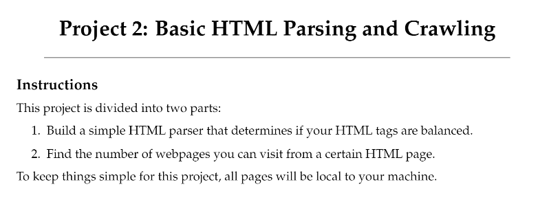
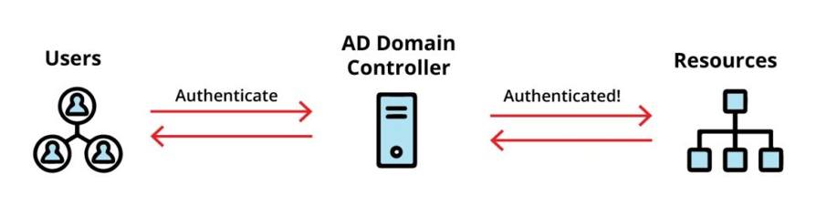
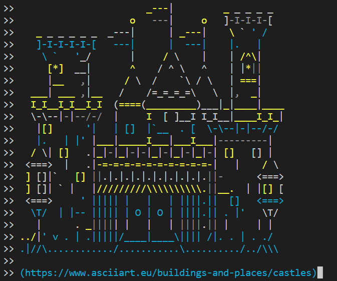
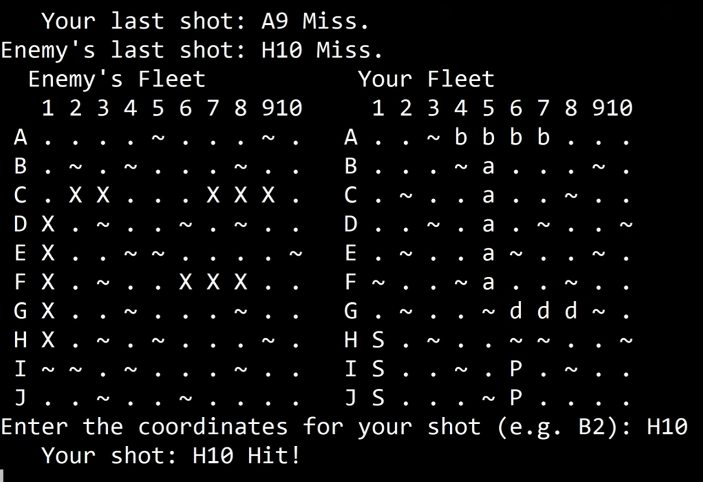
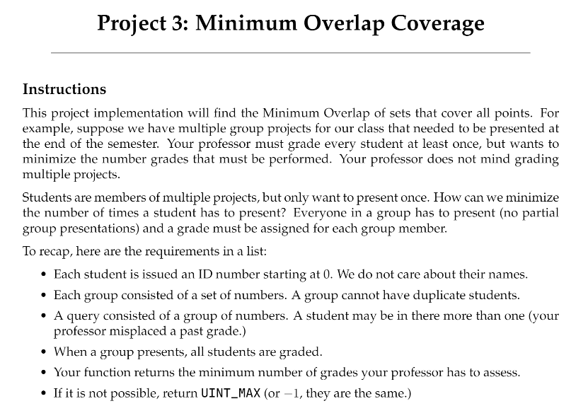

Portfolio
=========

Programming Projects
--------------------

*For access to my private project repositories, please [email me](mailto:BPFurrow@csustudent.net?subject=GitHub%20Access) with the subject line, GitHub Access.

---
### [Basic HTML Parsing and Crawling | CSCI 315](project1)

---
### [Active Directory Organizational Units | CSCI 352](project2)

---
### [Team Project - Castle of Conquest | CSCI 325](project3)

---
### [Final Project - Battleship | CSCI 235](project4)

### [Minimum Overlap Coverage | CSCI 315](project5)

---

Ethics Papers
-------------

### [THERAC Ethics Paper](/pdf/THERAC_Ethics_Paper.pdf)

-   **Class:** Data Structure Analysis (CSCI 315)
-   **Grade:** 99

### [Ethics of Vulnerability Disclosure](/pdf/Ethics_Paper_CSCI_325_Bryce_Furrow.pdf)

-   **Class:** Object-Oriented Programming (CSCI 325)
-   **Grade:** 100

### [Copyright Ethics Essay](/pdf/SSL_Ethics_Essay_Final.pdf)

-   **Class:** Survey of Scripting Languages (CSCI 301)
-   **Grade:** 92

---

Presentations
-------------

### [Paired Project Presentation](https://www.youtube.com/watch?v=V8e8S069ZzI)

- **Class:** Object-Oriented Programming (CSCI 325) 
- **Grade:** PASS

### [Security Presentation - Target Breach](https://youtu.be/rso59-3ZD6w)
- **[(Slides Used)](/pdf/SSL_Security_Presentation.pdf)**
- **Class:** Survey of Scripting Languages (CSCI 301)
- **Grade:** 100 

### [Active Directory Organizational Units](https://youtu.be/kUjx_AX7T0A)

- **Class:** Cyber Defense (CSCI 352)
- **Grade:** 100

---

<!-- 
Page template forked from <a href="https://github.com/csu-cs/csci-portfolio">CSU-CS</a>

<!-- Remove above link if you don't want to attributive -->
