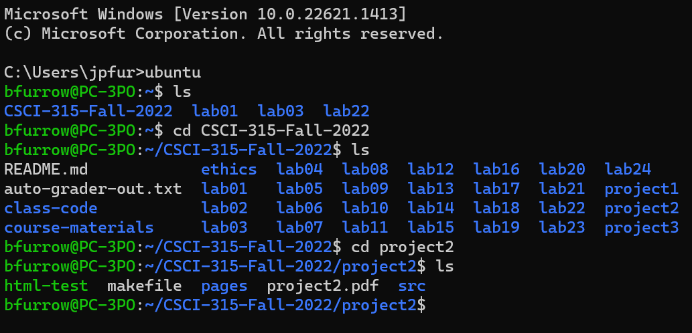
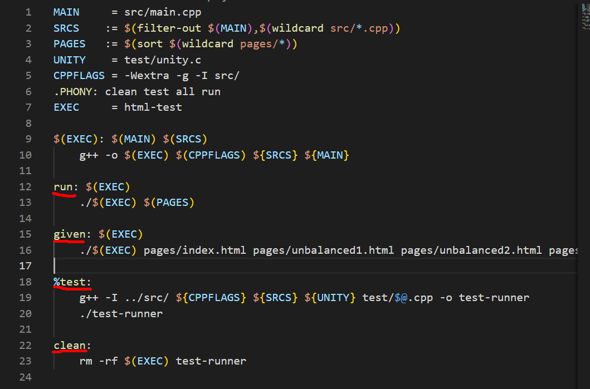
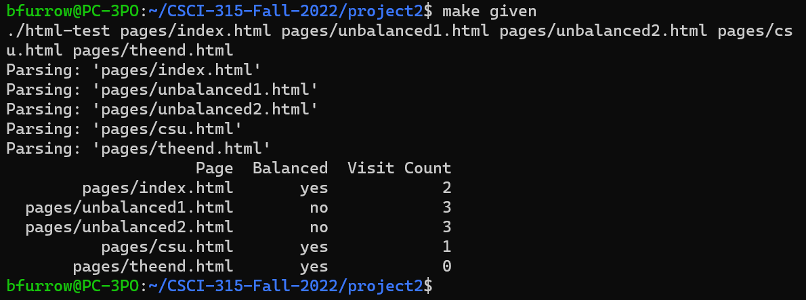
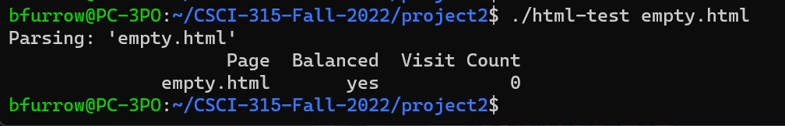

[Back to Portfolio](./)

Project 2: Basic HTML Parsing and Crawling
===============

-   **Class:** Data Structure Analysis (CSCI 315)
-   **Grade:** 95
-   **Language(s):** C++, HTML
-   **Source Code Repository:** [features/mastering-markdown](https://guides.github.com/features/mastering-markdown/)  
    (Please [email me](mailto:BPFurrow@csustudent.net?subject=GitHub%20Access) to request access.)

## Project description

This project consists of two parts. The first part is a simple HTML parser that can determine if the HTML tags in a given page is balanced or not. A page is considered balanced if each html tag has a beginning and ending tag at the same level of depth. The parser does so by iterating through the file, identifying tags, and then pushing/popping with a stack to determine if they are on the same level. The second part makes an HTML web crawler that, by visiting linked pages, determines the number of unique pages that can be visited from a certain page (excluding unvisitable pages such as those that don't exist). The web crawler does so using recursion to dive down into identified links, counting those that are unique and visitable. There are a number of test cases written as well to stretch the capabilities of the parser/crawler to its extremes.

## How to compile and run the program
Download the project from the GitHub repository as a zip file.
Unzip the project folder to a directory of your choice.
Using WSL Ubuntu, open the WSL Ubuntu terminal.
Navigate to the directory where you extracted the program files (using commands "ls" and "cd").
Type "make" in the terminal as a final setup before running the program.
Use either make commands or manually select pages to operate the program.
```cpp
make [makefile command]
// OR
./html-test [file name/relative location]
```
Further operation of the program is discussed in the UI design.

## UI Design

As it is stated in the description of this project, the program will allow the user to fulfill two specific operations. The program will tell the user if the inputted html page (or pages) is balanced and of how many unique pages can be visited (starting from a certain page). This program can be operated within WSL Ubuntu (see Fig 1). In the project folder, the user can type "make" to initialize the program, then proceed in one of two ways. The user can continue using make commands as it is displayed in the makefile (see Fig 2 and 3), or they can manually select pages by saying "./html-test (program to parse/crawl)" (see Fig 4). The results will then print out in the WSL Ubuntu terminal as seen in the two previous figures.

  
Fig 1. WSL Ubuntu display.

  
Fig 2. Makefile commands.

  
Fig 3. Example of a make command of the program.

  
Fig 4. Example of a manual execution of the program.

## 3. Additional Considerations

Sed ut perspiciatis unde omnis iste natus error sit voluptatem accusantium doloremque laudantium, totam rem aperiam, eaque ipsa quae ab illo inventore veritatis et quasi architecto beatae vitae dicta sunt explicabo.
[[???]]

For more details see [GitHub Flavored Markdown](https://guides.github.com/features/mastering-markdown/).

[Back to Portfolio](./)
