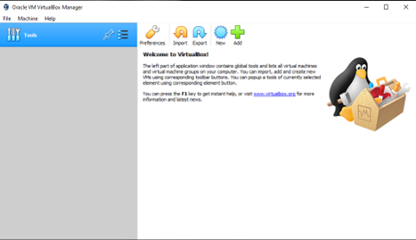
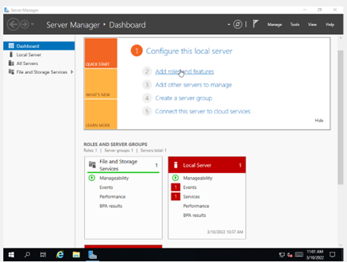
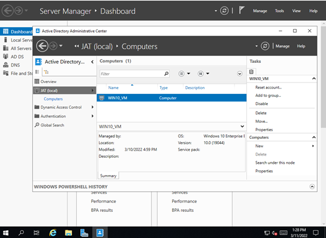
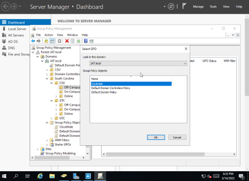

[Back to Portfolio](./)

Active Directory Organizational Units
===============

-   **Class:** Cyber Defense (CSCI 352)
-   **Grade:** 100
-   **Language(s):** N/A
-   **Source Code Repository:** [BFurrow-Collab/Portfolio-Project2](https://github.com/BFurrow-Collab/Portfolio-Project2)  
    (Please [email me](mailto:BPFurrow@csustudent.net?subject=GitHub%20Access) to request access.)

## Project description

This project was made as an assignment where the class would follow along a set of instructions. Starting with ISO files from a flashdrive to use with a virtual machine, the assignment would teach and show how to setup and apply Active Directory, Organizational Units, and Group/User Policies. This would demonstrate one of the primary ways that domain admins and network engineers mitigate potential risk with hardware security, network security, and controlling user access.

## How to run the program

All of the details of proceeding through this program are in the following document:   
[Organizational Unit with Group Policy Restriction](/pdf/Active_Directory_Organizational_Units_Exercise.pdf)
  
You may also follow this walkthrough video of these same steps (which is also located in the presentations section):  
[ADOU Video](https://youtu.be/IXLSksYSdv0)

## UI Design

You can find every step and topic of the user interaction within the two previous links - the documented steps and the walkthrough video. 

In the shorthand, though, the user will have to set up the VirtualBox virtual machine (see Fig 1), add the ISO files, setup and operate within Active Directory (see Fig 2 and 3), and create organizational groups with group policies (see Fig 4). In this case, we'll be seeing how a group policy can restrict even specific settings (like the system clock in the notification area).

  
Fig 1. The VirtualBox launch screen.

  
Fig 2. The Server Dashboard where the Active Directory is set up.

  
Fig 3. The Active Directory launch screen.

  
Fig 4. A group policy being setup and applied to a group.

## 3. Additional Considerations

[[???]]

[Back to Portfolio](./)
