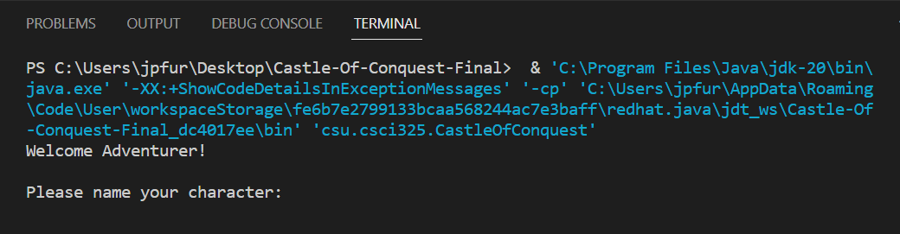
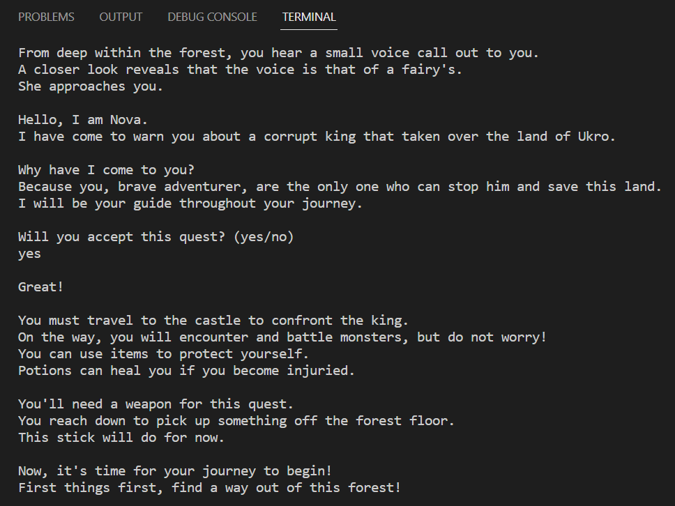
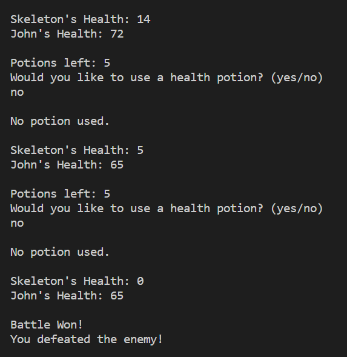
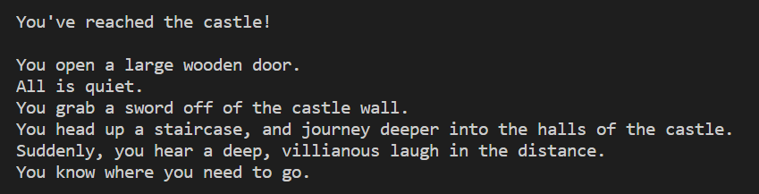
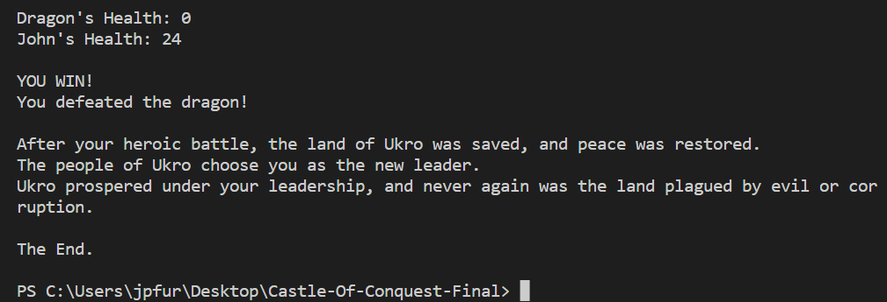

[Back to Portfolio](./)

Team Project - Castle of Conquest
===============

-   **Class:** Object-Oriented Programming (CSCI 325)
-   **Grade:** 100
-   **Language(s):** Java
-   **Source Code Repository:** [BFurrow-Collab/Portfolio-Project3](https://github.com/BFurrow-Collab/Portfolio-Project3)  
    (Please [email me](mailto:BPFurrow@csustudent.net?subject=GitHub%20Access) to request access.)

## Project description

Speaking of the game generally, Castle of Conquest is a text-based adventure game where a player traverses through a series of areas, fighting monsters and earning loot along the way. The player must make their way through four levels before they face off against the final boss to protect their land and win the game. Your hero, guided by a fairy named Nova, must find their way through the land of Ukro to stop the evil, corrupted king.  

The game starts by welcoming the player and asking them to name their character. The game will greet the player by name and start Level One in a forest setting. The player’s guide, Nova, will inform them that the corrupt king has taken over the land of Ukro, and they are the only one who can stop him. If the player accepts the challenge, the game will proceed to Level Two. In this level, the player will need to get out of the forest by fighting monsters. The player will not be able to proceed until each monster is defeated. The player may use 5 healing potions to help them progress through the game. When the user reaches the castle, Level Three will begin. In Level Three, the player will journey deeper into the castle in an attempt to locate the corrupt king. This area has stronger monsters that are more difficult to fight compared to those encountered in the forest. As the player makes their way through the castle, they eventually reach the center. There they find the corrupt king and a battle ensues (the start of Level Four). The corrupt king summons the final boss, a dragon, but loses control of it. The dragon turns on the king and then the player must defeat the dragon. Once the player defeats the dragon, the land is saved, and they win the game.  

Mechanically, everything is essentially a series of objects with attributes as well as some arrays alongside them. The story text is output triggered by the defeat of all the monsters in the area, which differs in each level. The areas which I worked in includes the player character, the monsters, their attributes, and the actions that can affect them both like attacking and healing. The player, the evil king, and the dragon each have a set maximum health. The player's damage depends on the level being played - each area starts with finding a new weapon with higher attack damage. The player can recover 20 points of lost health from potions, which they only have 5 from the start of the game to the end. Mob enemies such as skeletons have a certain range of health and attack damage, and each number is randomly chosen each time one of them appears. All attacks in the game follow this idea of range and randomization. 

## How to compile and run the program

Download the project from the GitHub repository as a zip file.
In whichever way you choose, download and install the latest JDK (Java Development Kit) for your system and/or IDE to use the program. 
(*Note: This project was originally programmed in NetBeans IDE. Therefore, not all the files present in the repository are necessary. However, those additional files were kept in case one would wish for it in its original form.*)  
Unzip the project folder to a directory of your choice.
Open a terminal of your preference that can use Java and start running the program.

## UI Design

Due to the nature of this project as a turn-based game, user interaction is a constant throughout rather than being of minimal input and output (which is the case for many other program projects). Some of the user interactions have already been stated in the description, but I will restate them anyways. The first prompt to the player asks to name their hero character's name, and the player can answer with any string. In order to save the time of a player, there are multiple times when a player can choose to stop playing in a yes/no answer. If the player says "no", the game ends. If they player says "yes", the game continues. One example of this is right after being informed of the quest and plight of the land. This is repeated the end of each level (besides at the ending). This option is also given if a player uses all 5 of their potions. This in place so that, if the player is in a bad place, they don't have to, turn-by-turn, run their health down until their character dies. There were attack and defense variations planned early on, but we decided that it'd be easier to have automatic attacks since the game is relatively short, so there is no user interaction in that respect. Overall, we decided to create an easier time for players rather than risking making something annoying, frustrating, and/or overcomplicated.

  
Fig 1. The Castle of Conquest launch screen.

  
Fig 2. The introduction of the game.

  
Fig 3. Example of an encounter with an enemy.

  
Fig 4. Example of the start of a level.

  
Fig 5. The ending of the game.

## 3. Additional Considerations

If I could have added anything to this project, it would be some sort of visuals. As the game is, it is entirely text-based. While the game is functional, it would be far more fun and interesting with that extra visual element. However, our time was limited and nobody in the group specialized in that sort of thing, so we didn't expand beyond our scope.  

[Back to Portfolio](./)
