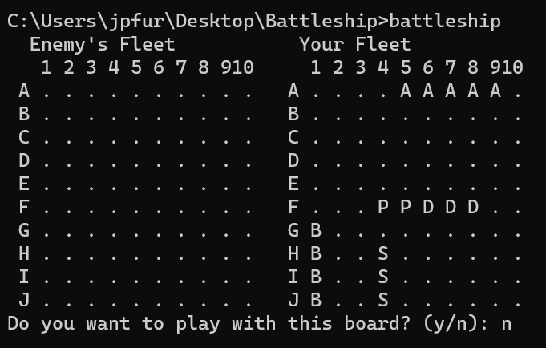
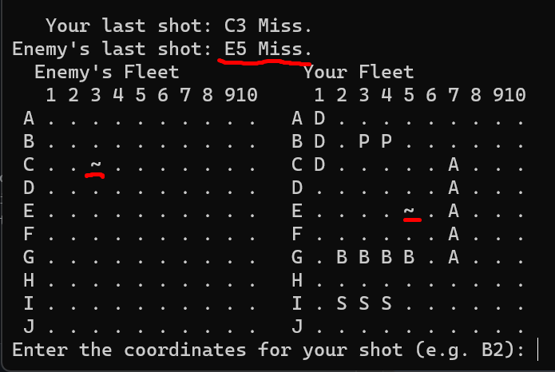
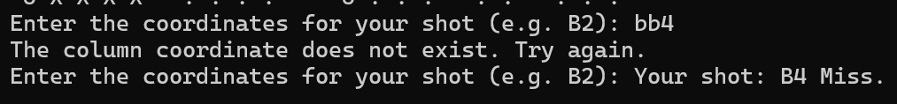
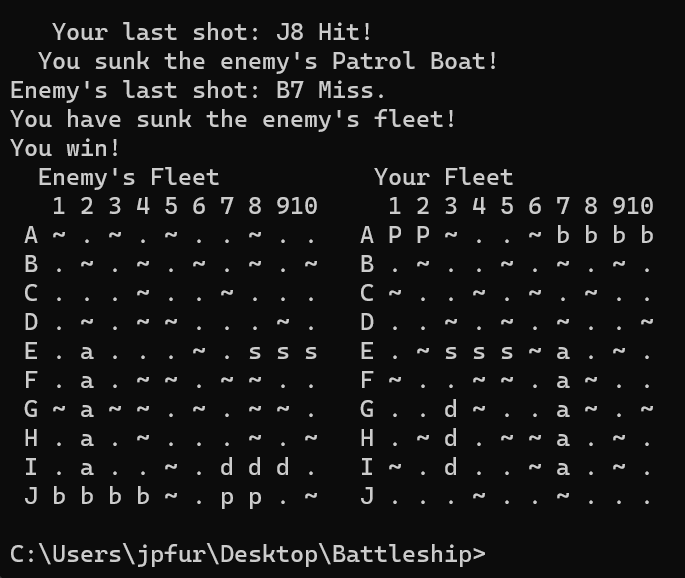

[Back to Portfolio](./)

Final Project - Battleship
===============

-   **Class:** Procedural Programming (CSCI 235)
-   **Grade:** 105
-   **Language(s):** C++
-   **Source Code Repository:** [BFurrow-Collab/Portfolio-Project4](https://github.com/BFurrow-Collab/Portfolio-Project4)  
    (Please [email me](mailto:BPFurrow@csustudent.net?subject=GitHub%20Access) to request access.)

## Project description

This project is, simply put, to program the game of Battleship. 
The game takes place within two 10 x 10 grids, one for the player and one for the AI. Each tile on the grid is represented by a row letter and column number (e.g. B3). Each ship takes up consecutive tiles, arranged either horizontally or vertically. The ships cannot overlap, and there is one type of each of varying lengths. 

<table style="border-collapse: separate; border-spacing: 1em 0;">
    <tbody>
        <tr>
            <th style="text-align: right; border-bottom: 1px black solid;">Ship Name</th>
            <th style="border-bottom: 1px black solid;">Length</th>
        </tr>
        <tr>
            <td style="text-align: right;">Aircraft Carrier</td>
            <td style="text-align: center;">5</td>
        </tr>
        <tr>
            <td style="text-align: right;">Battleship</td>
            <td style="text-align: center;">4</td>
        </tr>
        <tr>
            <td style="text-align: right;">Submarine</td>
            <td style="text-align: center;">3</td>
        </tr>
        <tr>
            <td style="text-align: right;">Destroyer</td>
            <td style="text-align: center;">3</td>
        </tr>
        <tr>
            <td style="text-align: right;">Patrol Boat</td>
            <td style="text-align: center;">2</td>
        </tr>
    </tbody>
</table>

In this program, the ship placement on the board will be randomly generated, and the user will have a yes/no choice on if they want to use the board. This will continue until the player says yes. Neither the player nor the computer knows where the ships are on their opponent's board - they are hidden. The player and the enemy AI then take turns choosing which tile on the board to target. If that tile had a ship, it's a hit signified by an 'X'. If it's a miss, it displays a '~'. When all tiles of a ship are hit, the ship is sunk, and the sinking is announced (e.g. "You sank the enemy's battleship!"). Whoever sinks all the opponent's ships first wins.
 
The programmed AI for the enemy was provided by the professor due to it being above the level of the class. The sections to work on included defining all the types and constants, displaying the game boards, placing the ships on the boards, controlling the player's turn, and setting up the game loop. Each of these had their own numerous substeps to aim for.

## How to compile and run the program

Download the project from the GitHub repository as a zip file.
Unzip the project folder to a directory of your choice.
Run the battleship.exe file that can be found in the Portfolio-Project4 GitHub repository (which is linked at the top of this page).
Using WSL Ubuntu, open the WSL Ubuntu terminal.
Navigate to the directory where you extracted the program files (using commands "ls" and "cd").
Further operation of the program is discussed in the UI design.

## UI Design

Due to the nature of this project as a turn-based game, user interaction is a constant throughout rather than being of minimal input and output (which is the case for many other program projects). As it was stated within the game rules in the project description, the user will start off by having a yes/no choice on a starting board with randomized ship placements (see Fig 1). The user will be prompted with new boards continuously so long as they say 'n' for no. Once they say 'y' for yes, the game will start. The enemy turns will be independent - out of the player's control. The player only has control of which letter-number tile they wish to target, an action prompted in text after the AI's turn (see Fig 2). This will continue until all the ships of either the user or the AI are sunk (see Fig 3 and 4). After this, the enemy's board will be revealed to the player (assuming that the player did not win).
 

  
Fig 1. The starting screen.

  
Fig 2. Example output after both a player and an enemy action.

  
Fig 3. Example of when the player inputs an invalid coordinate.

  
Fig 4. Example of when the player wins.

## 3. Additional Considerations

One additional point of significance would be the source of my extra 5 points beyond 100. 
This is because of various aesthetic and animation improvements made to the code. This includes an animation of random coordinates before the enemy AI displays its actual target coordinates, displaying output sentences as if they are being typed, and having an overall clean display with easily readable information.

[Back to Portfolio](./)
