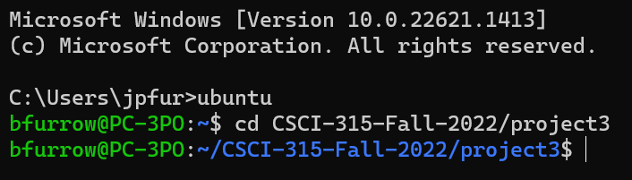
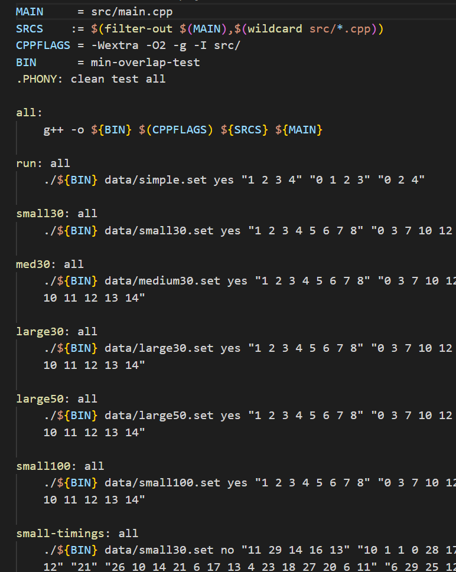
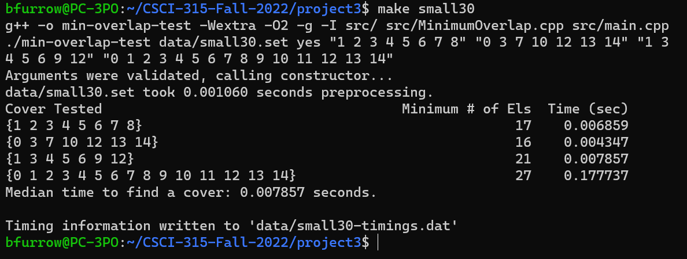
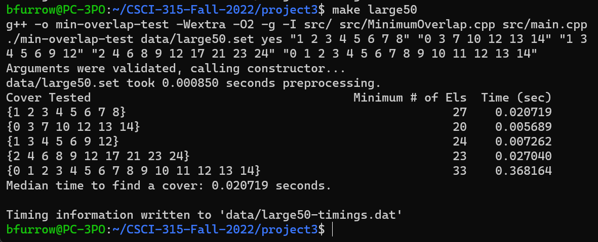

[Back to Portfolio](./)

Project 3: Minimum Overlap Coverage
===============

-   **Class:** Data Structure Analysis (CSCI 315)
-   **Grade:** 95
-   **Language(s):** C++
-   **Source Code Repository:** [BFurrow-Collab/Portfolio-Project5](https://github.com/BFurrow-Collab/Porfolio-Project5)  
    (Please [email me](mailto:BPFurrow@csustudent.net?subject=GitHub%20Access) to request access.)

## Project description

This project follows the scenario of a professer wanting to find the most efficient way to grade a series of group projects such that the number of gradings is minimized. The project implementation uses a set of numbers to represent each group of students, and each student has a unique ID number. The goal is to find the minimum number of grades required to assess everry student, while ensuring that each group presents once and every student presents once. The program takes an input containing the student ID sets that make up each group. The output of the program will be the minimum number of grades required to assess all students. Hence, we are finding the minimum overlap coverage.

## How to compile and run the program

Download the project from the GitHub repository as a zip file.
Unzip the project folder to a directory of your choice.
Using WSL Ubuntu, open the WSL Ubuntu terminal.
Navigate to the directory where you extracted the program files (using commands "ls" and "cd").
Type "make" in the terminal as a final setup before running the program.
Use either make commands or manually select pages to operate the program.
```cpp
make /*makefile command*/
// OR
./[[???]] /*file name/relative location*/
```
Further operation of the program is discussed in the UI design.

## UI Design

As it is stated in the description of this project, the program will allow the user to...
(NF)
This program can be operated within WSL Ubuntu (see Fig 1). In the project folder, the user can type "make" to initialize the program, then proceed in one of two ways. The user can continue using make commands as it is displayed in the makefile (see Fig 2 and 3), or they can manually select pages by saying "./[[???]] (program to parse/crawl)" (see Fig 4). The results will then print out in the WSL Ubuntu terminal as seen in the two previous figures.
(NF)

  
Fig 1. WSL Ubuntu display.
<br/>
  
Fig 2. Makefile commands.
<br/>
  
Fig 3. Example of a make command of the program.
<br/>
  
Fig 4. Example of a manual execution of the program.

<br/>

[Back to Portfolio](./)
